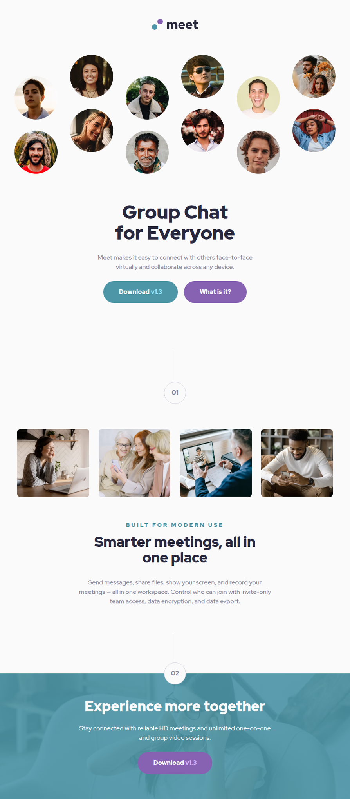

# Frontend Mentor - Meet landing page solution

This is a solution to the [Meet landing page on Frontend Mentor](https://www.frontendmentor.io/challenges/meet-landing-page-rbTDS6OUR).
Frontend Mentor challenges help improve frontend skills by building realistic UI components.

## Table of contents

- [Overview](#overview)
  - [Preview](#screenshot)
  - [Links](#links)
- [Features](#features)
- [My process](#my-process)
  - [Built with](#built-with)
  - [What I learned](#what-i-learned)
- [Setup](#setup)
  - [Installation](#installation)
  - [Development](#development)
  - [Build](#build)
  - [Linting](#linting)
- [Deployment](#deployment)
- [Performance](#performance)
- [Continued Development](#continued-development)
- [Useful Resources](#useful-resources)
- [AI Collaboration](#ai-collaboration)
- [Author](#author)
- [Notes](#notes)

## Overview

### The challenge

Users should be able to:

- View the optimal layout depending on their device's screen size
- See hover states for interactive elements

### Preview

<details>
  <summary>Click to expand website preview</summary>
  <br>
  <p align="center">
    
  </p>
</details>

### Links

- Solution URL: [GitHub Repo](https://github.com/vlrnsnk/meet-landing-page)
- Live Site URL: [Live Site](https://vlrnsnk.github.io/meet-landing-page)

## Features

- Responsive mobile-first layout
- Accessible interactive states (`hover`, `focus-visible`)
- Semantic HTML structure
- Modular SCSS architecture using `@use`
- CSS custom properties for design tokens
- Stylelint configuration with property ordering
- Automated image optimization pipeline with Sharp (WebP + AVIF generation)
- Optimized production build with Vite
- Automated deployment to GitHub Pages via GitHub Actions

## My process

### Built with

- Semantic HTML5 markup
- SCSS (modular architecture: abstracts, base, components, layout)
- CSS custom properties (design tokens via SCSS variables)
- Flexbox / Grid
- Mobile-first workflow
- Vite
- Sharp image processing
- Stylelint (code quality + property ordering)
- HTML validation
- Husky (pre-commit hooks)

### What I learned

- Improved responsive layout techniques using a mobile-first workflow and CSS Grid/Flexbox.
- Built a modular SCSS architecture using `@use`, design tokens, and reusable components.
- Implemented an image optimization workflow using Sharp to generate WebP and AVIF formats.

## Setup

### Installation

```bash
npm install
```

### Image optimization

Generate modern image formats:

```bash
npm run images
```

This creates .webp and .avif versions of images inside:

```bash
src/assets/images/
```

Example:

```bash
image-hero.png
image-hero.webp
image-hero.avif
```

Use <picture> with AVIF → WebP → original fallback:

````html
<picture>
  <source srcset="image.avif" type="image/avif" />
  <source srcset="image.webp" type="image/webp" />
  
</picture>

### Development ```bash npm run dev
````

### Build

```bash
npm run build
npm run preview
```

### Linting

```bash
npm run lint:scss
npm run lint:html
```

This project uses Stylelint + EditorConfig + Husky pre-commit hooks
to ensure consistent code formatting before commits.

### Fix linting issues:

```bash
npm run lint:scss:fix
npm run lint:html:fix
```

## Deployment

Project is built with Vite and deployed to GitHub Pages using GitHub Actions.

## Performance

Lighthouse score:

- Performance: 100
- Accessibility: 93
- Best Practices: 100
- SEO: 100

Accessibility score was reduced due to insufficient color contrast in the provided design palette.

## Continued Development

Use this section to outline areas that you want to continue focusing on in future projects. These could be concepts you're still not completely comfortable with or techniques you found useful that you want to refine and perfect.

## Useful Resources

- [MDN Web Docs](https://developer.mozilla.org/) - Used as a reference for modern HTML, CSS, and accessibility best practices.
- [web.dev](https://web.dev/) - Used for Lighthouse performance optimization guidance.

## AI Collaboration

Used AI tools throughout the development process:

- Gemini, ChatGPT, and Claude Code for debugging, code review, optimization ideas, and improving development workflow.
- AI was especially useful for troubleshooting build issues, refining SCSS architecture, and reviewing accessibility/performance improvements.

## Author

- Website: https://vlrnsnk.com
- Frontend Mentor: https://www.frontendmentor.io/profile/vlrnsnk
- GitHub: https://github.com/vlrnsnk

## Notes

- Accessibility-focused semantic markup
- Mobile-first responsive workflow
- Modular SCSS architecture using `@use`
- Consistent styling enforced with Stylelint
- Optimized Vite build pipeline
- GitHub Pages deployment with GitHub Actions
